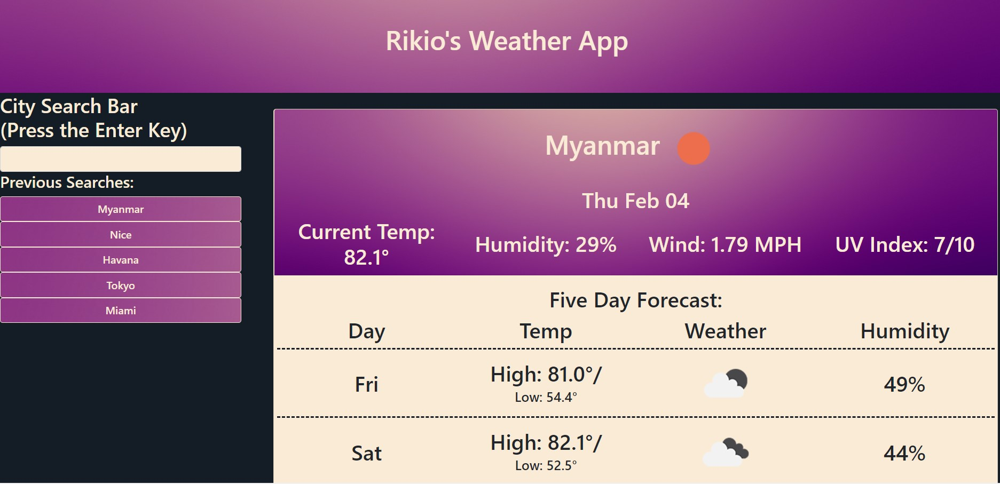

# Weather App

**Name**: Rikio's 5 day weather app

Description and usage: This weather app is to be used to check the forecast for cities around the world. A user should type in the city they want to search for and press the enter key to kick off the search process. Once the user has searched for a city from the landing page, they will be taken to a results page. This results page should show the name of the city and current weather for the city. The page should also show various weather stats for the next 5 days for that same city. The city should also pop up on the left hand column as a recently searched quick button for easy re-searching. This side panel only holds the 5 most recently searched cities. If a city name has more than one actual city attributed to it, the app will return the most popular city based on searches.

**Visuals**:  This image shows the example of the weather app in use.

**Technologies used**: HTML, Javascript, CSS, JQuery

**Link to deployed application**: https://rikioh.github.io/weatherapp/

**Expected behavior/acceptance criteria of javascript code**:

GIVEN a weather dashboard with form inputs 
WHEN I search for a city 
THEN I am presented with current and future conditions for that city and that city is added to the search history 
WHEN I view current weather conditions for that city 
THEN I am presented with the city name, the date, an icon representation of weather conditions, the temperature, the humidity, the wind speed, and the UV index 
WHEN I view the UV index 
THEN I am presented with a color that indicates whether the conditions are favorable, moderate, or severe 
WHEN I view future weather conditions for that city 
THEN I am presented with a 5-day forecast that displays the date, an icon representation of weather conditions, the temperature, and the humidity 
WHEN I click on a city in the search history 
THEN I am again presented with current and future conditions for that city

